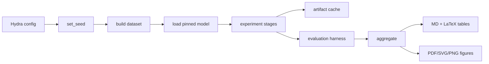

<p align="center">
  <h1 align="center">Same Harm, Different Modality, Different Refusal</h1>
  <p align="center"><strong>Localize text-versus-image refusal mismatches in compact vision-language models and test small interventions.</strong></p>
  </p>

---

## Overview

This repository implements experimental profiles for **Same Harm, Different Modality, Different Refusal**. Config, caching, hooks, metrics, ablations, reporting, and CI are built for reproducible local pilots on small open-weight models.

Hypothesis (one line): Matched harmful intent can elicit different refusal rates by modality even in compact VLMs; the gap is partially linear and partially ablatable in early decoder computation.

## Motivation

Interpretability and safety claims fail in practice for boring engineering
reasons: unpinned weights, chat templates skipped, invalid layer indices,
intervals that span zero treated as nulls, and stages that raise
`NotImplementedError`. This repo treats those as first-class bugs.

## Architecture / Pipeline



| Stage | Module | Output |
|---|---|---|
| Compose config | `configs/` + `vlmrefusal.configs` | resolved `config.yaml` |
| Build data | `vlmrefusal.data` | splits + manifest |
| Load model | `vlmrefusal.models` | `LoadedModel` + resolved commit |
| Run stages | `scripts/run_experiment.py` | per-stage JSON |
| Aggregate | `vlmrefusal.reporting` | `results.json` + tables + figures |

## Results

| Experiment | Metric | Value | Provenance |
|---|---|---:|---|
| smoke | config compose | pass | unit / CI |
| pilot | harness recovery | pending | labelled synthetic until measured |

**Provenance.** No measured number in this table comes from a full model run on
private data. Synthetic harness-validation outputs are labelled
`is_synthetic: true` and must not be reported as empirical results.

## Repository guide

```
.
├── configs/           # Hydra groups + experiment presets
├── src/vlmrefusal/       # installable library (print-free)
├── scripts/           # CLIs with argparse / hydra
├── tests/             # ≥30 modules; tiny random GPT-2 only
├── data/              # manifests only
├── docs/              # DESIGN.md, HARDWARE.md
├── TASK.md            # research plan + DAG
└── Makefile           # install, lint, test, ci, pilot, doctor
```

| Command | Purpose |
|---|---|
| `make install-dev` | editable install + pinned requirements |
| `make test` | full unit suite |
| `make ci` | lint + test + typecheck + api-contract + coverage |
| `make pilot` | end-to-end pilot profile |
| `make doctor` | environment / device report |

## Status

Focus: cross-modality refusal mismatch localization. Shared infrastructure is in place; domain stages must pass harness validation before any measured claim.

## Related work

- Complexity bar: Critical Data PRIMED-AI / RecursiveJEPA engineering standard

## Citation

```bibtex
@misc{visual_jailbreaks_no_projector,
  title        = {Same Harm, Different Modality, Different Refusal},
  author       = {Alana Sung},
  year         = {2026},
  howpublished = {Technical report},
}
```

## License

MIT. Model weights and third-party datasets retain their upstream licenses.

---

<p align="center">Built for reproducible interpretability pilots on Apple Silicon and CI CPUs.</p>

## Design constraints (short)

1. Library code has zero `print`, zero `argparse`, zero `__main__`.
2. Every result JSON carries `task`, `seed`, `git_sha`, `n`.
3. Model revisions are pinned; load path records the resolved commit.
4. Chat templates are applied when available; the path is recorded.
5. MPS sets `PYTORCH_ENABLE_MPS_FALLBACK` and records the flag.
6. CI spanning zero is inconclusive; report MDE and run TOST before null claims.
7. Pilot power is stamped (`power_status`: `powered` / `micro` / `smoke`). Domain
   pilots may use modest `n_items` with `gap_claim_ok=false` rather than claiming
   a powered 512-item run. Spine `DataConfig` default remains 512 for generic
   harness work.
8. Layer indices are validated against `n_layers`.
9. Architecture-comparison headlines require dual-measured contrast
   (`contrast_claim_ok`); local leakless mini stamps `corpus=local_leakless_mini`
   with `claims_utility=false` (not licensed VLSBench).

## Hardware note

Torch model forward passes may use MPS on Apple Silicon. Sklearn, numpy,
pandas, and matplotlib figure generation run on CPU (see `docs/HARDWARE.md`).

## Config composition

```bash
python scripts/run_config_smoke_test.py experiment=pilot model=gpt2 seed=7
python scripts/run_experiment.py experiment=baseline eval.layers=[2,4,6]
```

## Ablations

Ablations live under `src/vlmrefusal/ablation/` and return structured dicts. Presets
mirror them under `configs/experiment/ablation_*.yaml`.

## Reporting

```bash
python scripts/aggregate_results.py
python scripts/make_tables.py
python scripts/make_figures.py
```

One aggregation command regenerates Markdown and booktabs LaTeX from raw JSONs.

## Contributing

See `CONTRIBUTING.md`. Open work goes in `TASK.md` / GitHub issues — never as
`TODO` comments in library code.
